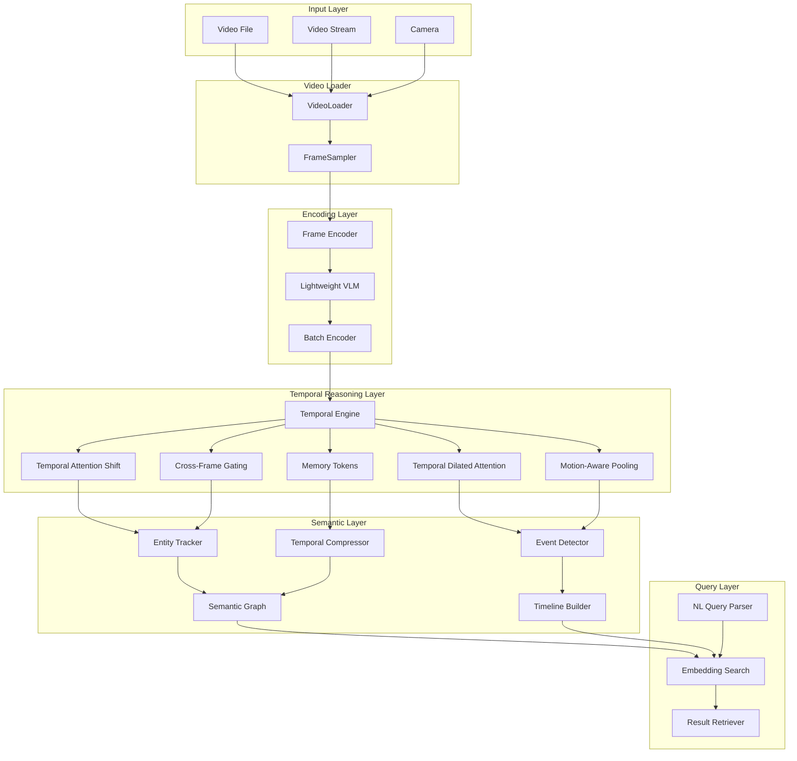

# Sharingan Design Document

## Overview

Sharingan is architected as a modular Python package that bridges the gap between low-level computer vision (OpenCV) and high-level semantic understanding (VLMs). The system employs a pipeline architecture with five core layers:

1. **Input Layer**: Video loading and frame extraction
2. **Encoding Layer**: Lightweight VLM-based semantic feature extraction
3. **Temporal Layer**: Advanced temporal reasoning modules
4. **Semantic Layer**: Timeline construction, entity tracking, and compression
5. **Query Layer**: Natural language interface and retrieval

The design prioritizes real-time performance, memory efficiency, and modularity to support both research experimentation and production deployment.

### Temporal Reasoning Foundation

The core innovation of Sharingan lies in its temporal reasoning capabilities. Unlike static image analysis, video understanding requires modeling temporal continuity, motion patterns, and causal relationships. Traditional approaches either ignore temporal information (frame-by-frame VLM inference) or use computationally expensive 3D convolutions and transformers that cannot run in real-time on edge devices.

Sharingan's temporal reasoning layer implements five complementary innovations:

1. **Temporal Attention Shift (TAS)**: Learnable attention-driven channel shifting with O(T × C) complexity
2. **Cross-Frame Gating Network**: Lightweight MLP-based temporal influence modeling
3. **Temporal Dilated Attention (TDA)**: Multi-scale temporal dependencies with dilated intervals
4. **Motion-Aware Adaptive Pooling**: Intelligent frame prioritization using optical flow
5. **Temporal Memory Tokens**: Streaming-capable global context maintenance

These modules work together to enable real-time semantic video understanding while maintaining low computational overhead and memory footprint.

## Architecture

### System Architecture Diagram



### Data Flow

1. **Video Input → Frame Extraction**: Video sources are loaded and frames are sampled adaptively
2. **Frame → Semantic Embedding**: Lightweight VLM encodes frames into semantic vectors
3. **Embeddings → Temporal Processing**: Temporal modules process sequences to capture dependencies
4. **Temporal Features → Semantic Structures**: Entity tracking, event detection, and timeline construction
5. **Semantic Structures → Compressed Context**: Hierarchical compression for memory efficiency
6. **Query → Retrieval**: Natural language queries are matched against compressed semantic representations

## Components and Interfaces

### 1. Video Module (`sharingan.video`)

#### VideoLoader
```python
class VideoLoader:
    """Handles video file and stream loading with unified interface."""
    
    def __init__(self, source: Union[str, int], backend: str = "opencv"):
        """
        Args:
            source: File path, URL, or camera index
            backend: Video backend ("opencv", "decord", "pyav")
        """
        
    def __iter__(self) -> Iterator[np.ndarray]:
        """Iterate over frames."""
        
    def get_frame(self, index: int) -> np.ndarray:
        """Random access to specific frame."""
        
    @property
    def fps(self) -> float:
        """Frames per second."""
        
    @property
    def total_frames(self) -> int:
        """Total frame count (None for streams)."""
```

#### FrameSampler
```python
class FrameSampler:
    """Adaptive frame sampling strategies."""
    
    def __init__(self, strategy: str = "uniform", target_fps: float = 5.0):
        """
        Args:
            strategy: "uniform", "adaptive", "motion_based"
            target_fps: Target sampling rate
        """
        
    def sample(self, frames: Iterator[np.ndarray]) -> Iterator[Tuple[int, np.ndarray]]:
        """Yield (frame_index, frame) tuples."""
```

#### Video (High-Level API)
```python
class Video:
    """Main user-facing video interface."""
    
    def __init__(self, source: Union[str, int], **config):
        """Initialize with video source and configuration."""
        
    def describe(self) -> str:
        """Generate natural language description of video content."""
        
    def detect_events(self) -> List[Event]:
        """Detect significant events in video."""
        
    def query(self, question: str) -> List[QueryResult]:
        """Natural language query interface."""
        
    def get_timeline(self) -> Timeline:
        """Get structured semantic timeline."""
        
    def track_entities(self) -> Dict[str, EntityTrack]:
        """Track all entities across frames."""
```

### 2. VLM Module (`sharingan.vlm`)

#### FrameEncoder
```python
class FrameEncoder:
    """Encodes frames into semantic embeddings using lightweight VLMs."""
    
    def __init__(self, model_name: str = "clip-vit-b32", device: str = "auto"):
        """
        Args:
            model_name: VLM model identifier
            device: "cpu", "cuda", or "auto"
        """
        
    def encode_frame(self, frame: np.ndarray) -> np.ndarray:
        """Encode single frame to embedding vector."""
        
    def encode_batch(self, frames: List[np.ndarray]) -> np.ndarray:
        """Batch encode multiple frames."""
        
    @property
    def embedding_dim(self) -> int:
        """Dimension of output embeddings."""
```

#### LightweightVLMHead
```python
class LightweightVLMHead:
    """Lightweight projection head for VLM features."""
    
    def __init__(self, input_dim: int, output_dim: int = 256):
        """Reduce VLM embedding dimensionality."""
        
    def forward(self, embeddings: np.ndarray) -> np.ndarray:
        """Project embeddings to lower dimension."""
```

### 3. Temporal Module (`sharingan.temporal`)

#### TemporalAttentionShift (TAS)
```python
class TemporalAttentionShift:
    """Learnable attention-driven temporal shift mechanism."""
    
    def __init__(self, channels: int, shift_ratio: float = 0.125):
        """
        Args:
            channels: Number of feature channels
            shift_ratio: Fraction of channels to shift
        """
        
    def forward(self, x: np.ndarray) -> np.ndarray:
        """
        Apply temporal attention shift.
        
        Args:
            x: Input tensor of shape (T, C, H, W)
        Returns:
            Shifted features of same shape
        """
```

#### CrossFrameGatingNetwork
```python
class CrossFrameGatingNetwork:
    """Lightweight MLP-based temporal gating."""
    
    def __init__(self, feature_dim: int, hidden_dim: int = 128):
        """Initialize gating network."""
        
    def forward(self, x_t: np.ndarray, x_prev: np.ndarray) -> np.ndarray:
        """
        Compute gated combination of current and previous frame.
        
        Args:
            x_t: Current frame features
            x_prev: Previous frame features
        Returns:
            Gated features
        """
```

#### TemporalDilatedAttention (TDA)
```python
class TemporalDilatedAttention:
    """Multi-scale temporal attention with dilated intervals."""
    
    def __init__(self, feature_dim: int, dilations: List[int] = [1, 4, 8, 16]):
        """
        Args:
            feature_dim: Feature dimension
            dilations: List of dilation intervals
        """
        
    def forward(self, x: np.ndarray, history: List[np.ndarray]) -> np.ndarray:
        """
        Apply dilated attention over temporal history.
        
        Args:
            x: Current frame features
            history: List of historical frame features
        Returns:
            Temporally attended features
        """
```

#### MotionAwareAdaptivePooling
```python
class MotionAwareAdaptivePooling:
    """Prioritize dynamic frames using optical flow."""
    
    def __init__(self, motion_threshold: float = 0.1):
        """Initialize with motion detection threshold."""
        
    def compute_motion_score(self, frame_t: np.ndarray, frame_prev: np.ndarray) -> float:
        """Compute motion score between consecutive frames."""
        
    def should_process(self, motion_score: float) -> bool:
        """Determine if frame should be processed in detail."""
        
    def forward(self, frames: List[np.ndarray], embeddings: List[np.ndarray]) -> np.ndarray:
        """Pool embeddings with motion-aware weighting."""
```

#### TemporalMemoryTokens
```python
class TemporalMemoryTokens:
    """Streaming temporal memory using learned tokens."""
    
    def __init__(self, num_tokens: int = 8, token_dim: int = 256):
        """
        Args:
            num_tokens: Number of memory tokens
            token_dim: Dimension of each token
        """
        
    def update(self, frame_embedding: np.ndarray) -> None:
        """Update memory tokens with new frame."""
        
    def get_context(self) -> np.ndarray:
        """Retrieve current temporal context."""
        
    def reset(self) -> None:
        """Reset memory for new video."""
```

#### TemporalEngine
```python
class TemporalEngine:
    """Unified interface for temporal reasoning modules."""
    
    def __init__(self, modules: List[TemporalModule], config: Dict = None):
        """
        Args:
            modules: List of temporal modules to compose
            config: Configuration for module coordination
        """
        
    def process_sequence(self, embeddings: np.ndarray) -> np.ndarray:
        """Process sequence through all temporal modules."""
        
    def process_streaming(self, embedding: np.ndarray) -> np.ndarray:
        """Process single frame in streaming mode."""
```

### 4. Tracking Module (`sharingan.tracking`)

#### EntityTracker
```python
class EntityTracker:
    """Track entities across video frames."""
    
    def __init__(self, max_age: int = 30, min_hits: int = 3):
        """
        Args:
            max_age: Maximum frames to keep track without detection
            min_hits: Minimum detections before confirming track
        """
        
    def update(self, detections: List[Detection], frame_idx: int) -> List[Track]:
        """Update tracks with new detections."""
        
    def get_active_tracks(self) -> List[Track]:
        """Get currently active tracks."""
```

#### Track
```python
@dataclass
class Track:
    """Represents an entity track across frames."""
    track_id: str
    entity_type: str
    bounding_boxes: List[Tuple[int, int, int, int]]  # (x, y, w, h)
    frame_indices: List[int]
    embeddings: List[np.ndarray]
    confidence_scores: List[float]
    
    def get_trajectory(self) -> np.ndarray:
        """Get center point trajectory."""
        
    def get_at_frame(self, frame_idx: int) -> Optional[Detection]:
        """Get detection at specific frame."""
```

### 5. Embedding Module (`sharingan.embedding`)

#### TemporalCompressor
```python
class TemporalCompressor:
    """Hierarchical compression of temporal embeddings."""
    
    def __init__(self, compression_levels: List[str] = ["frame", "segment", "event"]):
        """Initialize multi-level compression."""
        
    def compress_frames(self, embeddings: np.ndarray, window_size: int = 30) -> np.ndarray:
        """Compress frame-level embeddings."""
        
    def compress_segments(self, segment_embeddings: List[np.ndarray]) -> np.ndarray:
        """Compress segment-level embeddings."""
        
    def compress_events(self, event_embeddings: List[np.ndarray]) -> np.ndarray:
        """Compress event-level embeddings."""
        
    def get_compressed_context(self) -> Dict[str, np.ndarray]:
        """Get full hierarchical compressed context."""
```

#### SemanticGraph
```python
class SemanticGraph:
    """Graph representation of video semantics."""
    
    def __init__(self):
        """Initialize empty semantic graph."""
        
    def add_entity_node(self, entity: Track) -> str:
        """Add entity as graph node."""
        
    def add_event_node(self, event: Event) -> str:
        """Add event as graph node."""
        
    def add_temporal_edge(self, node1: str, node2: str, relation: str) -> None:
        """Add temporal relationship edge."""
        
    def add_spatial_edge(self, node1: str, node2: str, distance: float) -> None:
        """Add spatial proximity edge."""
        
    def query_subgraph(self, node_id: str, max_distance: int = 2) -> 'SemanticGraph':
        """Extract subgraph around node."""
        
    def to_dict(self) -> Dict:
        """Serialize to dictionary."""
```

### 6. Events Module (`sharingan.events`)

#### EventDetector
```python
class EventDetector:
    """Detect significant events in video sequences."""
    
    def __init__(self, sensitivity: float = 0.5):
        """
        Args:
            sensitivity: Event detection sensitivity (0-1)
        """
        
    def detect_events(self, embeddings: np.ndarray, timestamps: List[float]) -> List[Event]:
        """Detect events from temporal embeddings."""
        
    def detect_scene_changes(self, embeddings: np.ndarray) -> List[int]:
        """Detect scene transition frames."""
```

#### Event
```python
@dataclass
class Event:
    """Represents a detected event."""
    event_id: str
    event_type: str
    start_frame: int
    end_frame: int
    start_time: float
    end_time: float
    description: str
    confidence: float
    involved_entities: List[str]
    embedding: np.ndarray
```

#### TimelineBuilder
```python
class TimelineBuilder:
    """Construct structured semantic timeline."""
    
    def __init__(self):
        """Initialize timeline builder."""
        
    def add_event(self, event: Event) -> None:
        """Add event to timeline."""
        
    def add_entity_appearance(self, entity: Track) -> None:
        """Add entity appearance to timeline."""
        
    def build(self) -> Timeline:
        """Build final timeline structure."""
```

#### Timeline
```python
@dataclass
class Timeline:
    """Structured video timeline."""
    events: List[Event]
    entities: Dict[str, Track]
    scene_boundaries: List[int]
    duration: float
    
    def get_events_in_range(self, start: float, end: float) -> List[Event]:
        """Get events within time range."""
        
    def get_entities_at_time(self, timestamp: float) -> List[Track]:
        """Get entities present at timestamp."""
        
    def to_json(self) -> str:
        """Serialize timeline to JSON."""
```

### 7. Query Module (`sharingan.query`)

#### NaturalLanguageQuery
```python
class NaturalLanguageQuery:
    """Natural language query interface."""
    
    def __init__(self, text_encoder: Any):
        """Initialize with text encoder for query embedding."""
        
    def parse_query(self, query: str) -> QueryPlan:
        """Parse natural language query into execution plan."""
        
    def execute(self, query: str, video_context: VideoContext) -> List[QueryResult]:
        """Execute query against video context."""
```

#### QueryPlan
```python
@dataclass
class QueryPlan:
    """Parsed query execution plan."""
    query_type: str  # "spatial", "temporal", "event", "entity"
    query_embedding: np.ndarray
    temporal_constraints: Optional[Tuple[float, float]]
    spatial_constraints: Optional[Dict]
    entity_filters: List[str]
```

#### EmbeddingSearch
```python
class EmbeddingSearch:
    """Semantic similarity search over embeddings."""
    
    def __init__(self, index_type: str = "faiss"):
        """
        Args:
            index_type: "faiss", "annoy", or "simple"
        """
        
    def build_index(self, embeddings: np.ndarray, metadata: List[Dict]) -> None:
        """Build search index from embeddings."""
        
    def search(self, query_embedding: np.ndarray, k: int = 10) -> List[SearchResult]:
        """Search for top-k similar embeddings."""
```

#### QueryResult
```python
@dataclass
class QueryResult:
    """Result from natural language query."""
    timestamp: float
    frame_index: int
    description: str
    confidence: float
    bounding_box: Optional[Tuple[int, int, int, int]]
    related_entities: List[str]
    related_events: List[str]
```

### 8. Utils Module (`sharingan.utils`)

#### OpticalFlow
```python
class OpticalFlow:
    """Optical flow computation utilities."""
    
    @staticmethod
    def compute_flow(frame1: np.ndarray, frame2: np.ndarray, method: str = "farneback") -> np.ndarray:
        """Compute optical flow between frames."""
        
    @staticmethod
    def flow_magnitude(flow: np.ndarray) -> float:
        """Compute average flow magnitude."""
```

#### Config
```python
class Config:
    """Global configuration management."""
    
    @staticmethod
    def load(path: str) -> Dict:
        """Load configuration from file."""
        
    @staticmethod
    def get_default() -> Dict:
        """Get default configuration."""
```

#### HardwareAbstraction
```python
class HardwareAbstraction:
    """Hardware detection and optimization path selection."""
    
    @staticmethod
    def detect_hardware() -> Dict[str, Any]:
        """
        Detect available hardware capabilities.
        
        Returns:
            Dict with keys: has_gpu, gpu_memory, cpu_cores, device_type
        """
        
    @staticmethod
    def select_execution_path(user_preference: Optional[str] = None) -> str:
        """
        Select optimal execution path based on hardware.
        
        Args:
            user_preference: Optional override ("cpu", "gpu", "tiny")
        Returns:
            Execution path: "cpu_optimized", "gpu_accelerated", "tiny_device"
        """
        
    @staticmethod
    def get_optimal_batch_size(device_type: str) -> int:
        """Get optimal batch size for device type."""
        
    @staticmethod
    def configure_for_device(device_type: str) -> Dict[str, Any]:
        """Get device-specific configuration parameters."""
```

### 9. Hardware Optimization Paths

#### CPU-Optimized Path
- NumPy-based operations with BLAS acceleration
- Aggressive frame sampling (lower FPS)
- Reduced model precision (INT8 quantization)
- Smaller batch sizes (1-4 frames)
- Disabled or simplified temporal modules
- Target: 5-10 FPS on modern CPUs

#### GPU-Accelerated Path
- PyTorch/TensorFlow GPU operations
- Full temporal module stack
- Mixed precision (FP16) inference
- Large batch sizes (16-32 frames)
- CUDA streams for parallelism
- Target: 30-60 FPS on consumer GPUs

#### Tiny-Device Path (Raspberry Pi, Jetson Nano)
- Ultra-lightweight models (MobileNet-based)
- Minimal temporal processing (TAS only)
- Aggressive compression
- Frame skipping with motion detection
- INT8 quantization
- Shared memory optimization
- Target: 2-5 FPS on edge devices

## Data Models

### Core Data Structures

```python
# Frame representation
@dataclass
class Frame:
    index: int
    timestamp: float
    image: np.ndarray
    embedding: Optional[np.ndarray] = None
    motion_score: Optional[float] = None

# Detection representation
@dataclass
class Detection:
    bbox: Tuple[int, int, int, int]  # (x, y, w, h)
    confidence: float
    class_name: str
    embedding: np.ndarray

# Video context (compressed representation)
@dataclass
class VideoContext:
    frame_embeddings: np.ndarray
    segment_embeddings: np.ndarray
    event_embeddings: np.ndarray
    timeline: Timeline
    semantic_graph: SemanticGraph
    metadata: Dict
```

## Error Handling

### Exception Hierarchy

```python
class SharinganError(Exception):
    """Base exception for Sharingan package."""

class VideoLoadError(SharinganError):
    """Raised when video cannot be loaded."""

class EncodingError(SharinganError):
    """Raised when frame encoding fails."""

class TemporalProcessingError(SharinganError):
    """Raised when temporal processing fails."""

class QueryError(SharinganError):
    """Raised when query execution fails."""
```

### Error Handling Strategy

1. **Input Validation**: Validate all inputs at API boundaries
2. **Graceful Degradation**: Fall back to simpler methods when advanced features fail
3. **Informative Messages**: Provide actionable error messages with context
4. **Resource Cleanup**: Ensure proper cleanup of video handles and GPU memory
5. **Logging**: Comprehensive logging at DEBUG, INFO, WARNING, ERROR levels

## Testing Strategy

### Unit Tests

- **Video Module**: Test loading from files, streams, cameras; frame sampling strategies
- **VLM Module**: Test encoding with mock models; batch processing; dimension reduction
- **Temporal Module**: Test each temporal component independently; verify computational complexity
- **Tracking Module**: Test track creation, update, and termination; re-identification
- **Embedding Module**: Test compression ratios; semantic preservation
- **Events Module**: Test event detection accuracy; timeline construction
- **Query Module**: Test query parsing; embedding search; result ranking

### Integration Tests

- **End-to-End Pipeline**: Test complete flow from video input to query results
- **Streaming Mode**: Test real-time processing with simulated streams
- **Memory Usage**: Verify memory constraints on long videos
- **Performance**: Benchmark FPS and latency against requirements

### Test Data

- **Short Clips**: 5-10 second clips for unit tests
- **Medium Videos**: 1-5 minute videos for integration tests
- **Long Videos**: 10+ minute videos for memory and compression tests
- **Synthetic Data**: Generated sequences with known ground truth

### Benchmarking

Compare against baselines:
- **CLIP**: Frame-by-frame encoding without temporal modeling
- **SlowFast**: 3D CNN temporal modeling
- **TimeSformer**: Transformer-based temporal modeling

Metrics:
- **FPS**: Frames processed per second
- **Latency**: End-to-end query latency
- **Memory**: Peak memory usage
- **Accuracy**: Event detection accuracy, query relevance

## Performance Optimization

### CPU Optimization
- NumPy vectorization for batch operations
- Efficient frame sampling to reduce processing load
- Lazy loading of video frames
- Multi-threading for parallel frame encoding

### GPU Optimization
- Batch processing to maximize GPU utilization
- Mixed precision (FP16) for faster inference
- CUDA streams for overlapping computation
- Model quantization for reduced memory footprint

### Memory Optimization
- Hierarchical compression with configurable trade-offs
- Streaming processing with fixed memory budget
- Efficient data structures (e.g., sparse representations)
- Garbage collection hints for large arrays

### Caching Strategy
- LRU cache for frequently accessed frames
- Embedding cache for repeated queries
- Model weight caching across instances
- Precomputed optical flow for static cameras

## Deployment Considerations

### Package Distribution
- PyPI package with pip installation
- Conda package for scientific computing environments
- Docker images for containerized deployment
- Pre-built wheels for common platforms

### Dependencies
- Core: numpy, opencv-python, torch/tensorflow
- Optional: faiss-cpu/gpu, decord, pyav
- Development: pytest, black, mypy, sphinx

### Hardware Requirements
- Minimum: 4GB RAM, modern CPU
- Recommended: 8GB RAM, NVIDIA GPU with 4GB VRAM
- Optimal: 16GB RAM, NVIDIA GPU with 8GB+ VRAM

### Configuration
- YAML/JSON configuration files
- Environment variables for runtime settings
- Programmatic configuration via Python API
- Sensible defaults for common use cases
